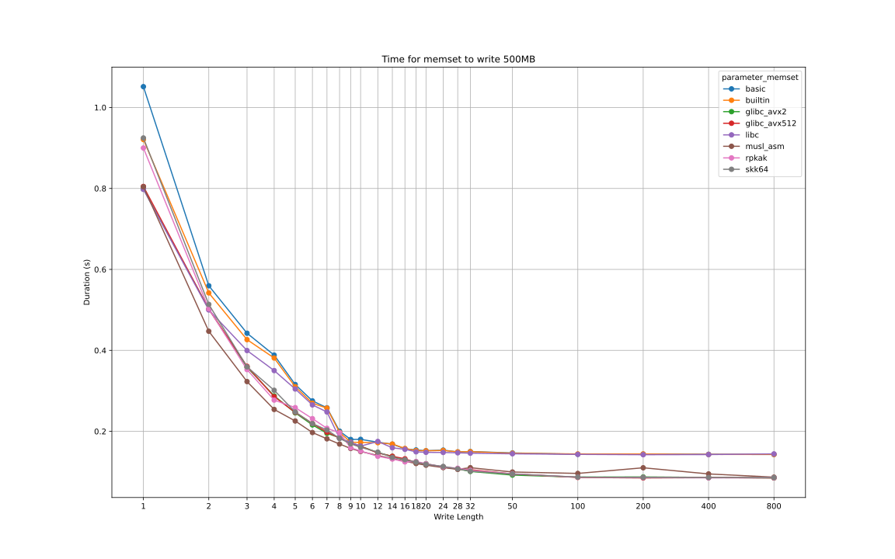
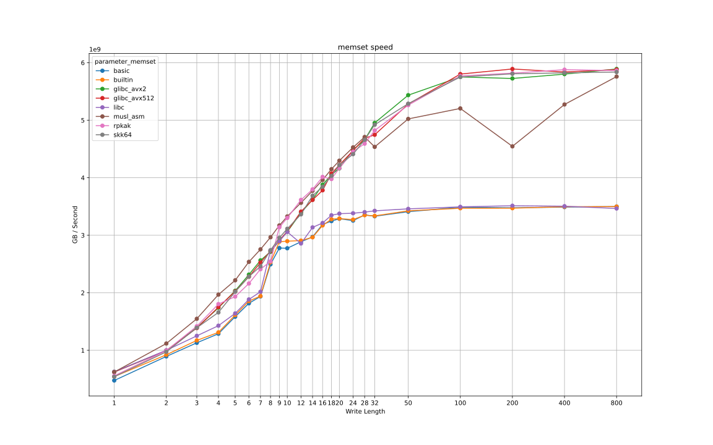
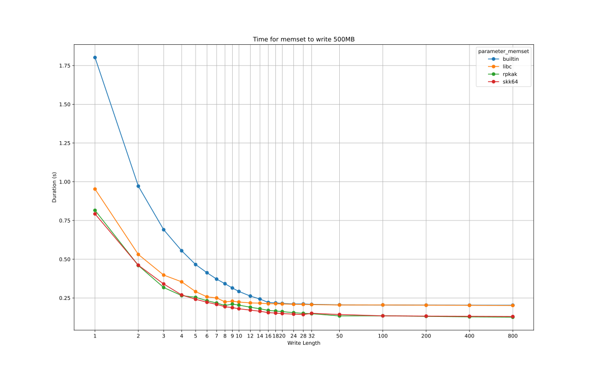
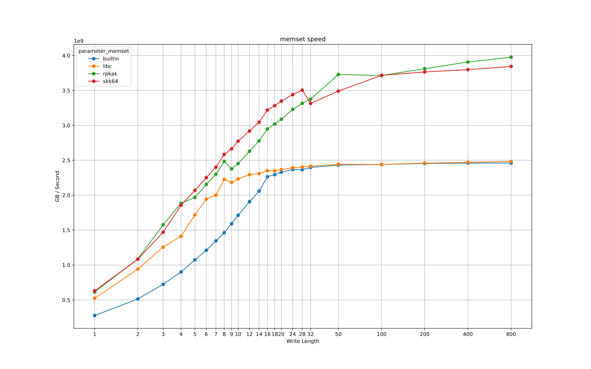
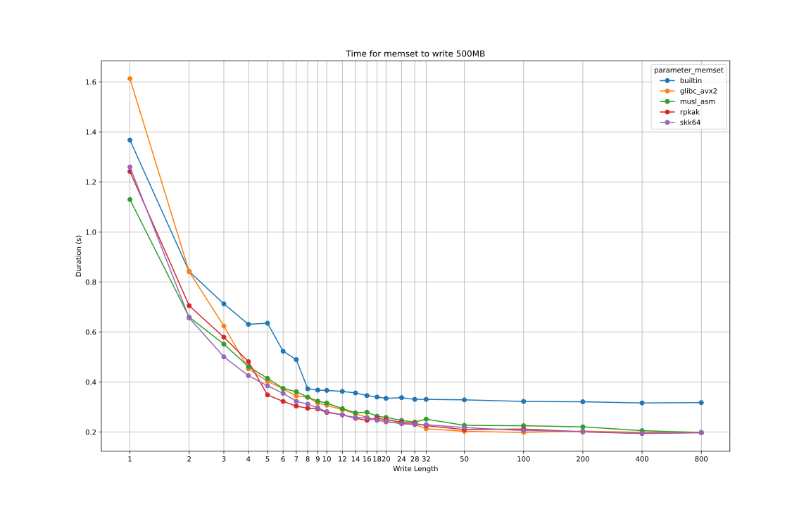
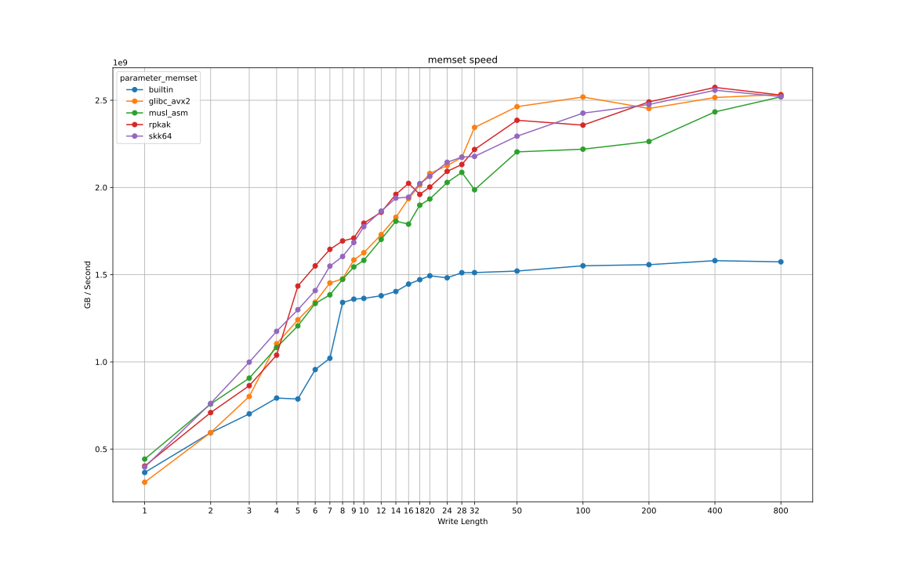

# Methodology

Every implementation is compiled in a separate object and linked as a extern function. The memset implementation is selected at runtime. This guarantees that optimizations in the benchmark won't sabotage the measurements.

The benchmark program selects a total number of bytes to write, and the length of bytes given for each call to memset (len parameter). Shorter memset calls means it is called more often until the entire byte range is written to. hyperfine is used to measure the time the program takes to run. it is measured against a range 

# Run

```
# Compile
zig build -Doptimize=ReleaseFast
# Run the benchmark (requires hyperfine)
sh gen_results(...)
# Plot the data (requires pandas and matplotlib)
python3 plot.py results.csv
```


# Code Samples

- rpkak: (https://zig.godbolt.org/z/3q3cG15YM)
- skk64: (https://zig2.godbolt.org/z/1G683Gcrf)


# Results

Write Length is the length parameter given for each call to memset.

Benchmarks were run on Ubuntu 26.04 (relevant for system libc memset).

## Google Cloud C4D instance 2vCPU (AMD zen4)


## Google Cloud C4A instance 2vCPU (Google axion aarch64)


## Intel 8565u (laptop cpu)



# Notes

libc in the charts is the system provided memset

The glibc assembly code was copied from (https://github.com/katsuster/bench_memset/). It is non-trivial to compile directly from the glibc source code.
